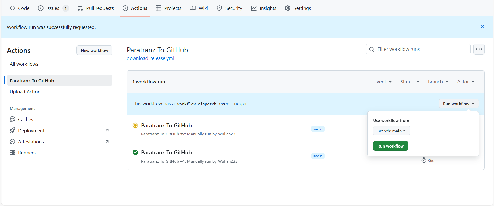

<div align="center"> 
   <h1>Ozone Skyblock Reborn 2 简体中文翻译</h1>
</div>

| CurseForge     | 加载器     | 整合包版本         | 汉化维护状态 |
| :------------- | :--------- | :----------------- | :----------- |
| [链接](https://www.curseforge.com/minecraft/modpacks/ozone-skyblock-reborn-2) | NeoForge | 1.21.1 1.3.3 | 翻译中       |

### 📌 汉化相关

- **汉化项目**：[Paratranz](https://paratranz.cn/projects/17669)
- **汉化发布**：[VM 汉化组官网](https://vmct-cn.top/modpacks/项目)
- **译者名单**：[贡献者排行榜](https://paratranz.cn/projects/项目/leaderboard)

# 📖 整合包介绍

## 简介

灵感源自 Project Ozone。极限合成、科技、魔法与自动化！Ozone Skyblock Reborn 的续作。

Ozone Skyblock Reborn 2 是一款专家级空岛任务整合包，旨在在挑战玩家的同时，通过大量任务引导玩家完成目标并获得奖励。整合包内包含数百个任务，这些任务将引导玩家体验适用于 Minecraft 1.21.1 的众多模组，其最终目标是合成仅限创造模式的物品，并完成一些“简单成就”。科技、魔法、探索、自动化等玩法触手可及！本整合包对多人游戏友好，并提供任务奖励共享选项。若要了解如何为每位玩家创建独立岛屿，请运行指令 /skyblock gui。

## 整合包模式

本整合包包含两种难度。第一种是 普通模式（Normal），其难度与 Project Ozone 的 Titan 模式 相近。第二种是 专家模式（Expert），其难度与 Project Ozone 的 Kappa 模式 相近。
指令如下：/packmode expert 用于切换至专家模式，/packmode normal 用于切换至普通模式。
整合包默认设置为普通模式。难度设置将适用于同一存档或服务器中的所有玩家。你需要启用作弊（单人世界中可通过“对局域网开放 → 启用作弊 → 输入指令 → 重启世界以关闭作弊”）或拥有服务器管理员权限。
如果你不想使用指令，也可以通过修改 /kubejs/config/common.json 来更改整合包模式。请务必在加载世界之前编辑该文件。
若你希望游玩专家模式，那么在整合包每次更新后，都需要再次执行该流程（无论是使用指令还是编辑文件），因为整合包更新后会默认重置为普通模式。

本整合包系列的灵感来源于 TheCazadorSniper 制作的整合包系列 Project Ozone。如果你之前没有体验过该系列，建议前往以下页面查看相关项目：[https://www.curseforge.com/members/thecazadorsniper/projects](https://www.curseforge.com/members/thecazadorsniper/projects)

---

需汉化模组
- Agritech: Evolved
- Re: Avaritia IO
- Useful Foundation
- Useful Machinery (partial)
- Condensed Ores
- Ex Machinis: Divitiae Deorum (partial)
- Creative Tools
- Deeper and Darker (partial)
- Nether Ex
- Dimension Expansion
- Dragonite Gear
- Haven Animal Seeds
- Hooper Gadgetry
- ~~Ytones~~
- Mob Flow Utilities
- RFTools Storage
- KubeJS (Modified Contents)
- Slab Machines
- Vertical Slabs

---

# ⚙️ 自动化 Paratranz 同步教程

## 1. 设置环境变量

1. 在仓库顶部导航栏依次进入：
   `Settings -> Environments -> New environment`，新建环境 `PARATRANZ_ENV`。

2. 在该环境中添加 **加密变量（Environment secrets）**：

   | 名称    | 值                                       |
   | ------- | ---------------------------------------- |
   | API_KEY | 你的 Paratranz token，需具备上传文件权限 |
   | CF_API_KEY| 如果采用CurseForge源检查更新须填此项|

   🔑 Token 可在 [Paratranz 用户设置页](https://paratranz.cn/users/my) 获取。

3. 在该环境中添加 **环境变量（Environment variables）**：

   | 名称 | 值                              |
   | ---- | ------------------------------- |
   | ID   | Paratranz 项目 ID，例如 `10719` |

## 2. 使用说明

我们目前有两个 GitHub Actions 工作流：

- **Paratranz → GitHub**：从 Paratranz 拉取译文至 GitHub 仓库。
- **GitHub → Paratranz**：将原文内容推送到 Paratranz。

> ✅ 两者均支持手动运行，操作如下图所示：



### 自动运行规则

- **Paratranz → GitHub** 会在北京时间 **每天早上与晚上 10 点左右** 自动执行。
- 下载译文至 GitHub 的功能可通过修改 `.github/workflows/download_release.yml` 内的 `cron 表达式` 自行设定执行时间。

📎 参考：[Cron 表达式教程](https://blog.csdn.net/Stromboli/article/details/141962560)

### 发布与检查机制

- 当有译文更改时，工作流会自动发布一个 **预发布 Release** 供测试。
- 每次同步上游后，会运行一次 **FTB 任务颜色字符检查程序**：

  - **发现错误**：在 Release 说明页面提示，并上传 HTML 报告至 **Artifacts** 和 **Release 页面**。
  - **未发现错误**：工作流详情页会提示找不到报告文件，此属正常情况，无需担心。

⚠️ 注意：

- **GitHub → Paratranz** 的同步任务使用频率较低，仅支持手动触发。
- 若项目已完成，请至仓库 **Settings** 中禁用工作流运行。

# ⚙️ 自动化整合包更新教程

本教程介绍如何配置 Actions 以实现自动检测 CurseForge 上的整合包更新，并创建包含更新文件的拉取请求（Pull Request）。

## 1. 首次配置

### 配置 `modpack.json`

在仓库的 `.github/configs/modpack.json` 文件中进行详细配置。此文件是自动化更新脚本的核心。

```jsonc
// .github/configs/modpack.json
{
  // [必需] 整合包在 CurseForge 上的数字 ID。
  "packId": 130,

  // [必需] 整合包的名称，用于生成 PR 标题等。
  "packName": "FTB StoneBlock 4",

  // [必需] 存储当前版本信息的文件路径。脚本会读写此文件。
  "infoFilePath": "CNPack/modpackinfo.json",

  // [必需] 存放整合包 `overrides` 目录内容的文件夹路径。
  "sourceDir": "Source",
  
  // [必需] 指定检查更新和下载文件的方法。
  // 可选值: "api" (默认) 或 "cursethebeast"。
  // "api" 方法需要配置 CF_API_KEY。
  "updateMethod": "cursethebeast",
  
  // [可选, 仅用于 'api' 方法] 版本号解析模板。
  // 用于从 CurseForge API 返回的完整文件名中提取干净的版本号。
  "versionPattern": "FTB StoneBlock 4 {version}",

  // [可选] "关注列表"，指定脚本只检查特定文件或文件夹的变更，可提高效率。
  // 如果此项为空，则默认对比整个 `sourceDir` 目录。
  "attentionList": {
    "folders": [
      {
        "path": "config/ftbquests/quests", // 检查此文件夹
        "ignoreDeletions": false // 不忽略删除操作
      }
    ],
    "filePatterns": [
      {
        "pattern": "kubejs/assets/*/lang/en_us.json", // 检查匹配此模式的文件
        "ignoreDeletions": true // 忽略删除操作（例如不删除我们自己创建的语言文件）
      }
    ]
  },

  // [可选] "排除模式列表"，用于从变更中排除特定文件。
  "exclusionPatterns": [
    "**/lang/*.*",       // 排除所有语言文件
    "!**/lang/en_us.*"   // 但保留 en_us 语言文件
  ]
}
```

## 2. 工作流说明

-   **工作流文件**：`.github/workflows/check_update.yml`
-   **触发方式**：默认在北京时间 **每天早上 6 点** 自动运行，也支持在 Actions 页面手动触发。

### 自动化流程

1.  工作流按计划或手动启动。
2.  脚本根据 `modpack.json` 的配置，检查 CurseForge 是否有新版本发布。
3.  **如果检测到新版本**：
    -   下载新旧两个版本的整合包存档。
    -   对比 `overrides` 目录中的文件差异。
    -   将文件的 **新增、修改、删除** 应用到 `sourceDir` 目录。
    -   更新 `infoFilePath` 中指定的版本号。
    -   创建一个新的分支，并提交所有变更。
    -   **自动创建一个拉取请求（Pull Request）**，其中包含清晰的变更摘要。
    -   生成一份详细的 HTML 差异报告，并将其链接评论到该 PR 中，供人工审查。
4.  **如果未检测到新版本**，工作流正常结束，不执行任何操作。

> ✅ **您的工作**：当机器人创建 PR 后，您需要做的就是 **审查 PR 中的文件变更**，确认无误后 **手动合并** 它，即可完成整合包的更新。
